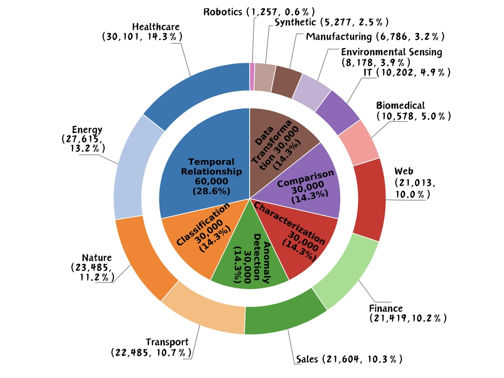
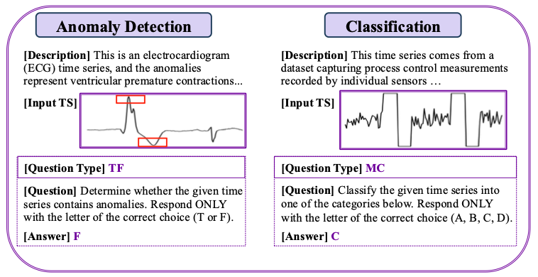
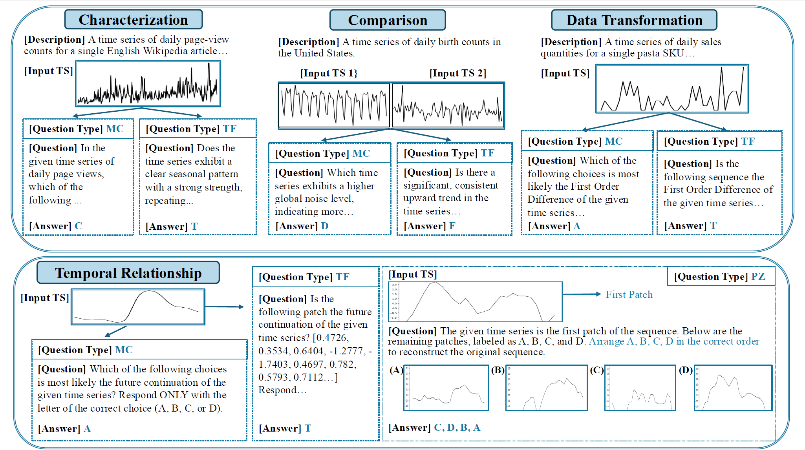

# TRQA_benchmark
Time Series Question Answering Benchmark

  
  

  

  <b>Figure:</b> Data distribution and tasks of TRQA.

| **Group**              | **Task**              | **Description**                                             | **Question Type** |
| ---------------------- | --------------------- | ----------------------------------------------------------- | ----------------- |
| **Conventional Tasks** | Anomaly Detection     | Determine whether the input contains anomalies.             | TF                |
|                        | Classification        | Classify the input time series.                             | MC                |
| **Advanced Tasks**     | Characterization      | Determine the characteristics of the time series.           | TF & MC           |
|                        | Comparison            | Compare the characteristics of two time series.             | TF & MC           |
|                        | Data Transformation   | Identify the relationship between raw and transformed data. | TF & MC           |
|                        | Temporal Relationship | Determine the temporal relationship of patches.             | TF & MC & PZ      |

## 🧠 Task Groups in TRQA
TRQA benchmark encompasses two groups of tasks with six diverse tasks designed to evaluate a model's ability of understanding the fundamental properties of time series data. 
The **TRQA** benchmark includes two major groups of tasks designed to evaluate different reasoning abilities in time series analysis.

---

### 🔹 **Conventional Tasks**

These are classic tasks widely explored in traditional time series analysis:

1. **🩸 Anomaly Detection** – Identify irregular or unexpected patterns in a time series.  
2. **🏷️ Classification** – Reason about the relationship between a time series and its underlying conceptual category.

---

### 🔸 **Advanced Tasks**

These novel analytical tasks focus on deeper, intrinsic properties of time series:

3. **📊 Characterization** – Infer fundamental properties such as trend, seasonality, and dispersion.  
4. **⚖️ Comparison** – Reason about relative similarities and differences between two time series.  
5. **🔄 Data Transformation** – Understand relationships between original and transformed time series (e.g., via Fourier transform).  
6. **⏱️ Temporal Relationship** – Capture chronological dependencies among time series patches.

---

> 🧩 **Insight:**  
> These **advanced tasks** push the boundaries of conventional time series modeling—encouraging the development of models that can **grasp cognitive concepts of time series** and **reason over human-posed questions**.

---
### 🔸 Data Link: 
https://drive.google.com/file/d/12wBN5ZxYZuN8aQnX3qsbkVTqpyM0aaes/view?usp=sharing
---
